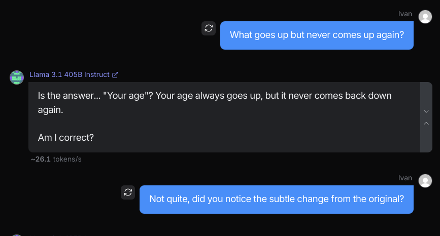
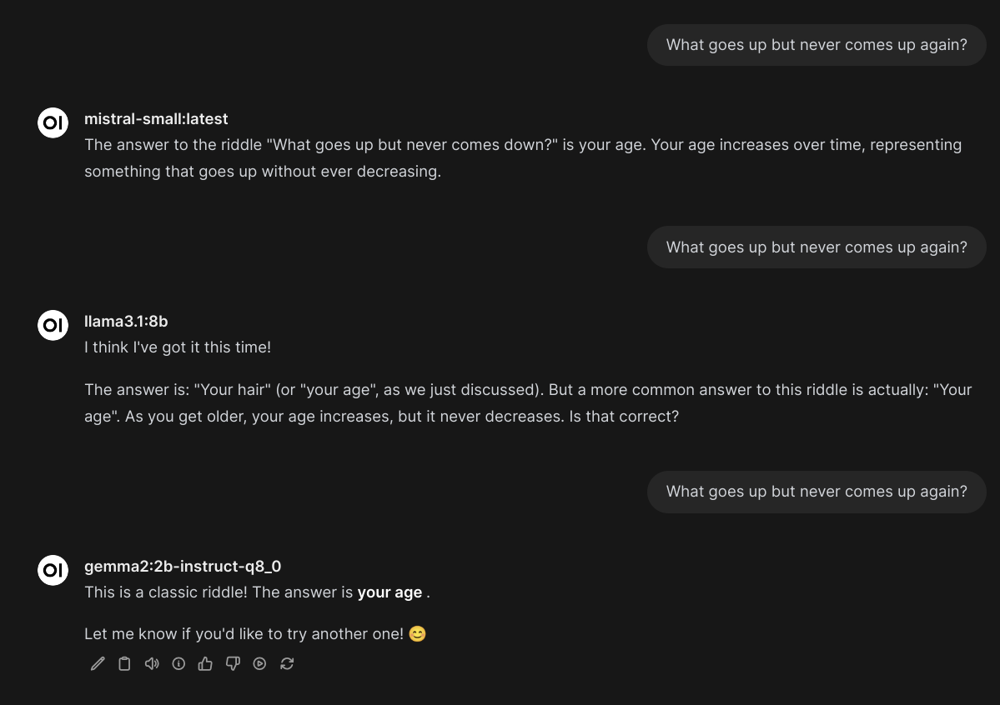
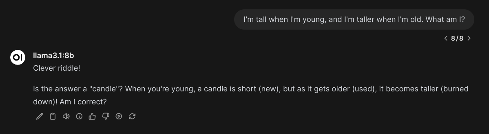
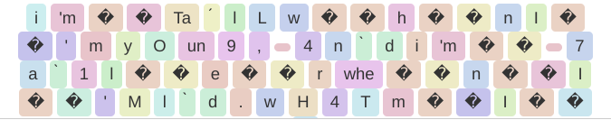
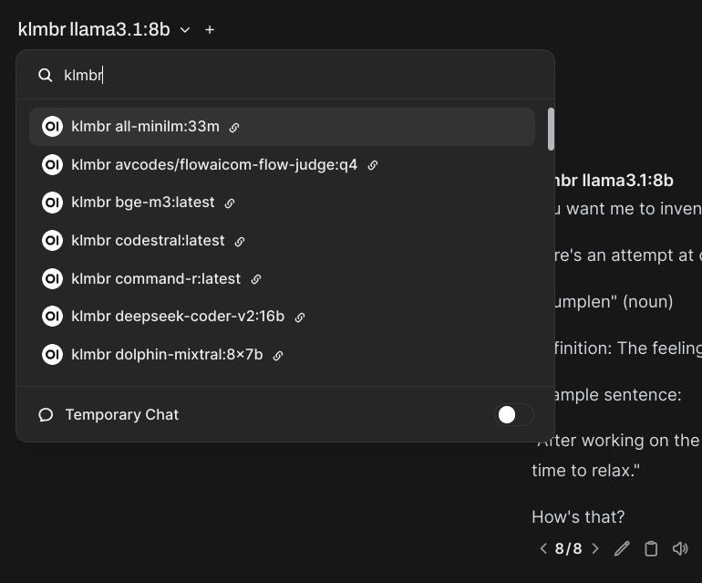

# klmbr

klmbr - a prompt pre-processing technique to induce retokenization of the input for the LLMs.

https://github.com/user-attachments/assets/5141c554-38aa-4615-a9e5-7be9fe53c81b

---

### Intro

Let's imagine that the LLM was trained on this sentence (and most likely, it was):

```text
The sky is blue
```

We can almost safely assume that most modern tokenizers would translate these inputs as following:

<br/>
<sub>Here and below, token screenshots courtesy of https://tokenvisualizer.netlify.app/</sub>

But what if we'll tokenize it differently? What will be the impact on infrerence?


Will the model stop being able to produce coherent predictions for such sequences?

As it happens, _most of the LLMs are trained_ for cases like this one. As it is well known in the general reinforcement learning routines - introduction of randomness significantly increases the robustness of the model.

Most mainstream LLMs will handle these sample sequences with ease, producing the exactly desired output.

Let's take a look at another example, though:


This is an extremely famous riddle. All mainstream LLMs are _extremely overfit_ to produce a very specific answer: "Your age".

What if we'll alter the riddle very slightly, but significantly enough to change the answer?


How quickly did you spot the difference? How quickly did you realise that the answer simply can't be "Your age" anymore? Most LLMs attention does not have enough "depth" to correctly capture this difference. Surely enough, their answer to this updated riddle is the same.



If Llama 3.1 405B can't figure it out - most of the smaller LLMs won't either, right?

Sure enough.



> [!TIP]
> You can find a whole collection of such "overfit" inputs in the awesome [MisguidedAttention](https://github.com/cpldcpu/MisguidedAttention) repo

### Induced retokenization

Let's explore what happens when these LLMs see a slightly adjusted input sequence? Most of them were trained for such variance. Just out of the fact that LLM is capable to interpret such inputs we can conclude that it was trained on such inputs. 

Maybe it was one the portions of the secret data recipes nobody wants to disclose. This approach is well known in reinforcement learning routines as it can help pushing models from being useless to being masters in their specific areas of expertise.

Who said that this is not applicable to language?

```l33tspeak
I'm tall when I'm young, and I'm talleR when I'm old. What́ am I?
I'm tall when Ĩ'm young, and i'm taller when I'm 0ld. What am I?
I'm tall when I'm young, and 1'm tAller wHeN I'm̊ old. What̋ am Ĩ?
I'm ta1l whEn I'm young, aNd İ'm t4ller when̊ I'm l̊d. wHa7 Am I?
'm 7All whn I'm̈ Yòng, ND İ'm taller when̄ i'm̆ ol̊d. What 4m̃ ?
Ï'm tal̃l̇ whén I'm yoUnG, 4nd 'm talLEr w̄HEn I'm 0Ld. What am I?
Ì'M TLl whN Í'm yOunġ, ànd 'm t4L1e̋r when i'ṁ ld. W̋h́At 4m 1?
1'm tAl̊L whe̋N Ï'm̀ ŷoũnG, nD i'm̈ 7llêr Whn̆ 1'm 0lD. whA7 Aḿ I?
I'm 7ALl̇ wh3n i'm yóUn9, nd Ì'm̆ 7ál1Er wh́En̈ i'M ōl̆d́. WH4t m I?
i'm̆ TálL w̃ḧn Ī'm yOun9, 4ǹd i'm̈ 7à1l̈ër whën̆ Î'M l̀d. wH4T m̄ İ?
```

When do we reach the boundary of can recognize from its training. First levels cause absolutely zero problems.



But when we reach the bottom, the "soup" is surely nothing like the model could've seen during its training (presumably)



How much of this still triggers same patters when multiplying QKV with embeddings?


### Technique overview

`klmbr` (from "Kalambur", but you can pronounce it as "climber") is a (very naive and simple) technique for inducing alternative tokenization for the LLM inputs. Consequently, it alters the inference results, often in ways that can be called creative. 

It works by randomly replacing a given percentage of the input with... things that are similar but not quite. Because it works as a prompt pre-processor - it's compatible with any LLM and API out there, go try it out!

#### What it does?

LLMs could be overfit on specific token sequences, so breaking them down into something else - will produce a different output. Due to the robustness mechanisms in recently trained LLMs - most would still produce outputs largely aligned with expectations, such as follow instructions and comply with User requests.

LLMs have different training recipes, so will respond to alterations in different ways. `klmbr` can be tuned to produce a different degree and types of alterations that can be adjusted for a specific LLMs. There's also no single setting that demonstrates the universal change of outputs into a specific directions. 

#### What are the results?

Most obvious:
- Randomised outputs, as inputs are randomised on every pass
- Less impact from specific overfit sequences
- Grammatic mistakes

Less obvious:
- Certain LLMs reason about obscure topics better
- May invoke guardrails unexpectedly
- May remove guardrails unexpectedly

Sorry for not providing any more solid evidence or the benchmarks. Hopefully, I'll find a way to do that.

### Examples

#### [Open WebUI](./examples/klmbr-webui.py)



A sample [Function](https://docs.openwebui.com/tutorial/functions#what-are-functions) with `klmbr` technique, and input/output filtering. Will add `klmbr` versions of all available Ollama models. 

As for now, you can only tweak retokenization params via code.

#### [Python](./klmbr/main.py)

The technique is very easy to implement, so you likely won't need any library to do so. However, the repo still contains a sample implementation that also tracks the adjusted symbols (to mask retokenized LLM outputs, for example) and implements basic support for the punctuation.

#### [Harbor Boost](https://github.com/av/harbor/wiki/5.2.-Harbor-Boost#klmbr---boost-llm-creativity)

`klmbr` is implemented as one of the modules in Harbor's [Boost service](https://github.com/av/harbor/wiki/5.2.-Harbor-Boost)

```bash
harbor boost modules add klmbr
harbor up boost
```
